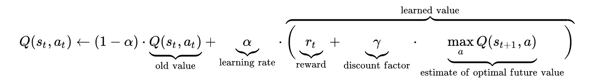

# CartPole-Q-Learning

<B><h3>INTRODUCTION :</h3></B>
It is a basic project which combines the flavour of <a href = "https://gym.openai.com/"> Gym - an open AI</a> software made for developing and comparing
(Reinforecemnt Learning) RL algorithms, with the <a href = "https://en.wikipedia.org/wiki/Q-learning">Q-leaning</a>. 
Here, is an image to show the update rule of Q-leaning.  
 

<B><h3>PERFORMANCE :</h3></B>
<h4><B>So, here are some graphics, how our cart behaved at it initial phases.</B></h4> 

